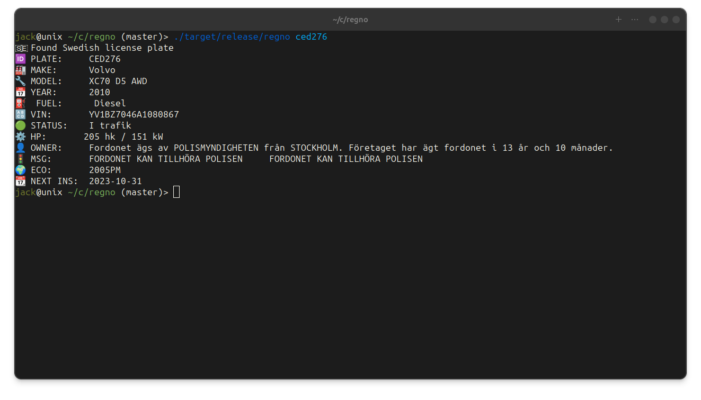

# regno

`regno` is an application for looking up vehicle registration numbers and car information.

- 🇸🇪 Supports Swedish Plates
- 🇳🇴 Supports Norwegian Plates
- 🇮🇪 Supports Irish Plates
- **Spanish, Finnish, and German plates coming soon!**



**Hint:** This project is still in development and was created as my learning experience for Rust. E.g., it lacks moderate error-handling for now.

## Features

- `types.rs`: Contains the types used for describing car information.
- `biluppgifter.rs`: Performs operations for fetching and processing Swedish car information. 🇸🇪
- `ncts.rs`: Performs operations for fetching and processing Irish car information. 🇮🇪
- `main.rs`: The main program where everything runs.
- `utils.rs`: Helper functions and utilities used throughout the project.

## Project Structure

```
regno
├── src
│ ├── biluppgifter.rs // Handles Swedish car information 🇸🇪
│ ├── ncts.rs // Handles Irish car information 🇮🇪
│ ├── types.rs // Types used for describing car information
| ├── regnr.rs // Handles Norwegian car information 🇳🇴
│ ├── main.rs // Main program
│ └── utils.rs // Utility functions
└── README.md
```

## Prerequisites

- Rust 1.52 or higher

## Installation

1. Clone this repository:

    ```
    git clone https://github.com/jackbillstrom/regno.git
    ```

2. Build the project:

    ```bash
    cd regno
    cargo build
    ```

## Usage

Run the program with:

```bash
cargo run -- ced267
./regno ced267
```

## Contributing

If you'd like to contribute, please create a Pull Request.

## License

This project is licensed under the MIT License.
